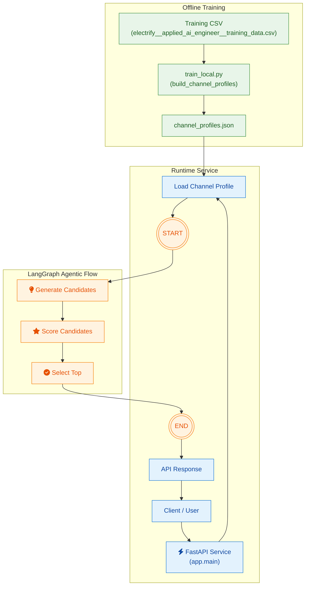

### Agentic Videos Performance Analyzer

FastAPI service for an agentic workflow that learns patterns of high-performing YouTube titles per channel and generates 3–5 new titles with data-grounded reasoning.

### Project Overview

 - Ingests a training CSV with data per video (channel_id, video_id, title, summary, views_in_period).

 - Computes statistics and patterns of videos per channel in title length, punctuation, keywords. It then uses TF-IDF to extract keywords for both top-performing and low-performing videos. These features then form the channel's profile.

 - An AI agent orchestrates the flow of the process with the generation of new titles for a proposed video summary leveraging an LLM. The system conditions the generation on the channel’s style and the high‑performing videos' patterns discovered during analysis. It returns 3–5 candidate titles along with a short data-grounded explanation for each.

### Architecture

    
### Directory Structure

app/
  
  __init__.py
  
  main.py          # FastAPI application and HTTP endpoints; loads profiles
  
  config.py        # Centralised configuration (paths, model name, temperature, LLM)
  
  profiles.py      # Builds per‑channel profiles from the CSV using TF–IDF and computes statistics
  
  generator.py     # Prompt, LLM call and scoring
  
  agent_graph.py   # Defines the simple generate→score→select_top agent workflow
data/
  
  electrify__applied_ai_engineer__training_data.csv  # Training data
scripts/
  
  train_local.py   # Script to build channel profiles
  
  EDA.ipynb # Initial exploratory analysis on each channel
  
  Advanced Feature Engineering.ipynb # Further analysis on keyword extraction
artifacts/
  
  channel_profiles.json  # Generated profiles

### Installation

1. Clone this repository and set it as the project directory.

2. Create a virtual environment (recommended):
    - python -m venv .venv
    - source .venv\Scripts\activate

3. Install dependencies from requirements.txt:
    - pip install -r requirements.txt

4. Set OpenAI API key as environment variable for LLM usage:
    - export OPENAI_API_KEY="{paste API key here}"

### Running the API

 - This block describes how the FastAPI-based service is run. When a request arrives, the service loads the channel profile and invokes a LangGraph-based agentic workflow to generate a response.

1. Profile Builder: Before executing the API, the profiles have to be built, which include the channel and the features associated with the videos. These features include aggregated statistics on views, high and low performing keywords, punctuation rates and saves these in a JSON dictionary keyed by channel_id. For this run:

    - python -m scripts.train_local

2. Launch the API with Uvicorn:

    - uvicorn app.main:app --reload

3. The LangGraph agent contains the following nodes:
  
    1. START: initializes the agent with the user input and channel profile.
        
    2. GENERATE: calls an LLM via the OpenAI Chat API to generate candidate titles
    based on the input and profile.

    3. SCORE: evaluates each candidate using a scoring function (e.g., length, presence of digits, punctuation marks), outputting scores which are then normalized through min-max normalization.

    4. SELECT_TOP: selects the top‑scoring candidate(s).

    5. END: returns the selected result back to the FastAPI layer, which
    packages it as a JSON response to the client.

### Endpoints

## POST /generate_titles

 - Function: generates 3-5 titles and per-title reasoning grounded in features associated with the channels' profiles

 - Query Parameters: num (optional, integer 3-5); determines the number of titles to generate (defaults to 5).

 - Request body:
 {
  "channel_id": string,
  "summary": string
}

 - Example use case:
 
  curl -X 'POST' \
  'http://127.0.0.1:8000/generate_titles?num=3' \
  -H 'accept: application/json' \
  -H 'Content-Type: application/json' \
  -d '{
  "channel_id": "UC510QYlOlKNyhy_zdQxnGYw",
  "summary": "A look at the history of solar‑powered tank technology"
}
'

 - Response:

{
  "suggestions": [
    {
      "title": "History of Notable Solar Tank Designs",
      "explanation": "At 5 words (avg≈7), this title is shorter to the channel's norm and uses the high-performing keyword \"notable\"."
    },
    {
      "title": "Oversized Solar Tanks: A Historical Overview",
      "explanation": "At 5 words (avg≈7), this title is shorter to the channel's norm and uses the high-performing keyword \"oversized\"."
    },
    {
      "title": "Evolution of Solar-Powered Tank Technology",
      "explanation": "At 5 words (avg≈7), this title is shorter to the channel's norm."
    },
    {
      "title": "Solar Tank Tech: Key Milestones",
      "explanation": "At 5 words (avg≈7), this title is shorter to the channel's norm."
    },
    {
      "title": "Timeline of Solar Tank Advancements",
      "explanation": "At 4 words (avg≈7), this title is shorter to the channel's norm."
    }
  ]
}