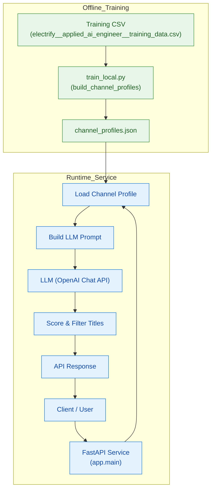

### Agentic Videos Performance Analyzer

FastAPI service for an agentic workflow that learns patterns of high-performing YouTube titles per channel and generates 3–5 new titles with data-grounded reasoning.

### Project Overview

 - Ingests a training CSV with data per video (channel_id, video_id, title, summary, views_in_period).

 - Learns patterns of videos per channel in title length, punctuation, keywords and other features associated with higher views, which define the boundary between high and low-performing videos.

 - Generates new titles for a proposed video summary using an LLM. The system conditions the generation on the channel’s style and the high‑performing patterns discovered during analysis. It returns 3–5 candidate titles along with a short explanation for each.

 - Provides an API that external callers can use to request title suggestions for any channel in the training data.

### Architecture

    
### Directory Structure

app/
  __init__.py
  main.py          # FastAPI application and HTTP endpoints
  config.py        # Optional configuration via Pydantic settings
  profiles.py      # Profiles every channel based on aggregated statistics, and linguistic feature engineering
  generator.py     # Title generation, scoring and prompt construction
  schemas.py       # Pydantic models for request/response schemas
data/
  electrify__applied_ai_engineer__training_data.csv  # Training data provided with the task
scripts/
  train_local.py   # Script to build channel profiles and save them to JSON
artifacts/
  channel_profiles.json  # Generated profiles (created at runtime of application)

### Installation

1. Clone this repository and set it as the project directory.

2. Create a virtual environment (recommended):
    - python3 -m venv .venv
    - source .venv\Scripts\activate

3. Install dependencies from requirements.txt:
    - pip install -r requirements.txt

4. Set OpenAI API key as environment variable for LLM usage:
    - export OPENAI_API_KEY="{paste API key here}"

### Running the API

1. Profile Builder: Before executing the API, the profiles have to be built, which include the channel and the features associated with the videos. These features include aggregated statistics on views, high and low performing keywords, punctuation rates and saves these in a JSON dictionary keyed by channel_id. For this run:

    - python -m scripts.train_local \
  --input data/electrify__applied_ai_engineer__training_data.csv \
  --output artifacts/channel_profiles.json

2. Launch the API with Uvicorn:

    - uvicorn app.main:app --reload

### Endpoints

 - Example use case:
 
    curl -X POST \
  'http://127.0.0.1:8000/generate_titles?num=5' \
  -H 'Content-Type: application/json' \
  -d '{
    "channel_id": "UC510QYlOlKNyhy_zdQxnGYw",
    "summary": "A look at the history of solar‑powered tank technology"
  }'

  - OR in the application:
        ...
